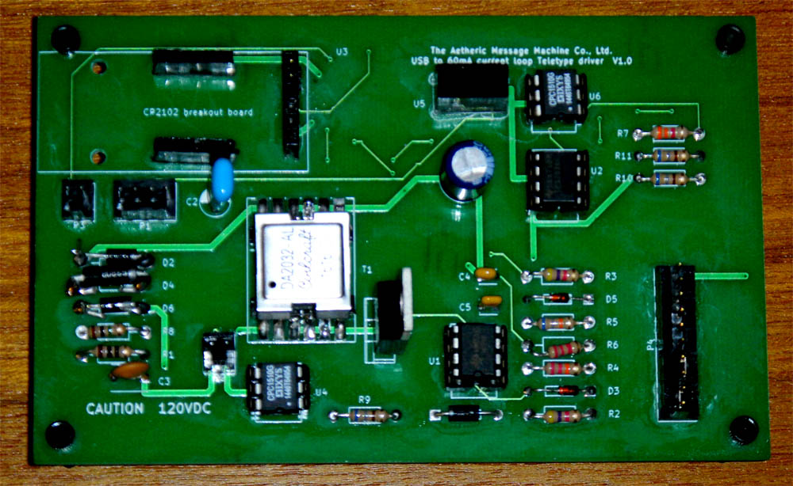

# ttyloopdriver
Hardware device for driving antique Teletype machines

WORK IN PROGRESS. 
Status: version 1 not successful.  The 555 timer can't produce
enough peak drive for the MOSFET, and only about 20V comes out.
Redesign underway.

# What it is

This is a board to allow connecting antique Teletype machines to a computer through
a USB port. It's for Teletype Model 14 and 15 machines, which use 60mA current
loops.   This board needs no external power supply other than the USB port.
This approach uses only about 1 watt of power, drawing 200mA from the USB port. 

# How it works

With a switching power supply, of course.

At the USB end is a CP2012 breakout board.  The Silicon Labs CP2102 is a USB
to serial converter, one of the few which can be reprogrammed for 45 baud
opeation.  We reprogram it to map a request for 600 baud to 45 baud.

We also set it to request 250mA from the USB port. USB ports have
power limits.  USB devices are guaranteed 100mA, but if you want 
more than that, you have to ask.  During the USB enumeration 
handshake, the USB device can ask for more current, up to 500
mA for USB versions 1 and 2.  The host device can say yes or
no to the power request.  If the host device says yes, the
CP2012 turns on /SUSPEND after successful completion of the
power handshake.  Turning off the device in software (as when
the host computer goes to sleep) will turn off /SUSPEND.

U3 is a TPS2030P power control IC intended for USB ports.  When
/SUSPEND goes high, it turns on and lets power into the rest of
the board.  It also has a built-in 300mA power limit, which
limits the inrush current as C1 charges at power up.  This
is required to keep from crashing small USB host devices at
power up.

The switching power supply consists of an oscillator and a
switcher. The oscillator, U1, is a classic 555 timer, set
up for approximately 100KHz, 25% duty cycle.

The switcher is an isolated boost supply, consisting of
Q1, T1, C2, and some passives.  The oscillator signal
turns Q1 on and off. Turning Q1 off produces an inductive
kick in T1, which has a 1:10 turns ratio.  This can produce
over 120VDC, which is used to charge C2.  To limit the
charge, D4, a 120V Zener diode, clamps the voltage
to 120V. Charging occurs during SPACE.

When the input signal from the serial port (TxD) goes
high (a SPACE to MARK transition) it triggers opto-isolator 
U4, which dumps the energy from C2 into the output for the Teletype machine.
This briefly provides 120V at 60mA into the expected 4 H load
of a Teletype selector magnet, which is what the machine
needs.  Once C2 has discharged, the switcher continues to
run, but under the load of the 55 ohm selector magnet,
can only produce a few volts. The component values are
selected to provie about 60mA continuous in this mode.
This holds the selector magnet in during the remainder of
the MARK period.

R1 and C3 are a filter for the inductive spikes from
the Teletype selector magnet. D6 protects C2 against
negative-going spikes from the selector magnet.

On the keyboard side, U5, an very small 5V to 24V DC-DC
converter, produces enough voltage for Teletype keyboard
contacts, which may have oil or dirt on them.  A 5V
logic level is known to be too weak for this.  Another
opto-isolator, U6, isolates the keyboard from the logic
level circuitry.

On the Teletype side, everything is isolated from ground and from the USB side.

# Connectors

P1 is the Teletype connection. Pins 1 and 2 go to the
printer, pins 3 and 4 go to the keyboard.

P2 is a connection for a current meter.  A 100mA meter
is suggested. If a meter is not used, this plug must
be jumpered.

P3 is a connection for a solid state relay (5V in) to
turn on the Teletype motor.  Use of this is optional.

P4 is for an optional front panel, with on/off switch,
power and motor lights, and a break button.  If not used, jumper 1-2, 3-4, and 5-6.
