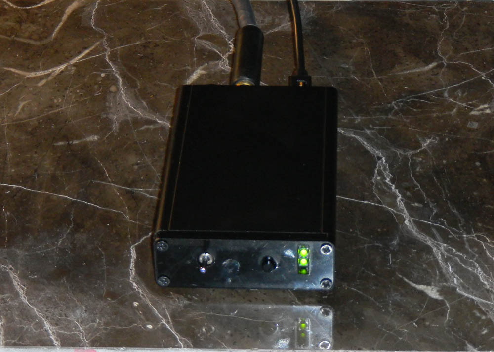

# ttyloopdriver
Hardware device for driving antique Teletype machines

 
## Status 

Version 3.3 works, successfully driving a Model 15
Teletype.

## Version log

### Version 1

Version 1 not successful.  The 555 timer can't produce
enough peak drive for the MOSFET, and only about 20V comes out.
Redesign underway.

### Update 2016-12-19

Redesign complete. SPICE model (in directory "circuitsim/ttydriver.asc") works.  Gil Smith is building up a prototype for
circuit testing.  If that works, a new PC board will be designed.

The next PC board will have switches, LEDs, and phone jacks on the board, so no external wiring harness
will be required.

### Update 2017-04-18

Board 2.0 will drive a Model 15 Teletype with a few changes to the board.  The keyboard side doesn't work.
Board 2.1 being built.

### Update 2017-04-21

Board 2.1 will drive a Model 15 Teletype with the following fixes:

- Bypass USB current limiter U2 by jumpering pins 1 to 6.  It's tripping at too low a current.  Check R16 value again.
Printer side is then OK. After further testing, the current limiter is working fine; it trips if the printeroutput
is shorted or there's no selector magnet plugged in. After about 10 seconds, U2 will cool down and re-enable power.

- Keyboard side needs a lower value resistor for R9 than 2.2K. Not enough pulldown.

- Jumpering R9 with a 1.5K resistor makes the keyboard side work. That's equivalent to an R9 value of about 
900 ohms.  4.5V/900 = 5mA there, for 0.03W. OK.  Try 1K for R9.

- Motor control LED is always on.  Probably a pullup resistor problem.  RTS is an active low. RTS signal
shows 3V for OFF, 0.2V for ON in current circuit, but U7 remains on even for the OFF condition.
R17 needs to be larger, or this needs a redesign.

### Update 2017-05-13

Board 2.2 not built; more pull-in energy is needed. The voltage decays too fast, and only
one of three Teletypes will work with the 1uf @ 120V cap.  Board 2.3 will have 2uf @ 120V. 
This should provide enough punch to pull in the selector fast enough. Github files are updated
to Board v2.3.0, but the board has not been sent to fab yet.

### Update 2017-05-15

Board 2.3 sent to fab.

### Update 2017-06-20

Board 2.3 can't charge its 2uf of capacitors in less than 40ms.
The LTSPICE model and the real board disagree in transformer current
by about 2x. Unclear why.  Possible transformer saturation.

Efficiency calc: 
    
2uf at 120V is  14.4mJ
    
400mA at 4.8V is 1.92W. 1.92W x 20ms = 0.0384 watt-seconds = 0.0384 joules = 38.4 mJ

Efficiency needed is 14.4 / 38.4 = 38%. Should be easily achieveable.

### Update 2017-08-25

Board 3.1, a completely new design using an LT3750 capacitor charging controller, works, except 
that the current limiter U2 keeps tripping. Successful typing with a Model 15 Teletype.
The capacitors charge to 122V in about 14ms, which is close to what simulation predicts.

The AP2553W6 current limiter trips for about half a second about twice a minute on average. 
If the current limiter is bypassed, it works fine.  Measured current through the current limiter,
with a 2.2 ohm current sense resistor placed in series for testing,  is I = E/R = 0.5/2.2 = 227mA.
This is well below the current limiter setpoint.  R1 at 56.3K ohms should result in a 400mA current
limit. Unclear why the limiter is tripping. 

(Turned out that the current limiter was tripping because the circuit for motor control was
back-feeding power into the U2 from the output side, which the current limiter detects as
a fault condition.)
    
### Update 2017-09-18

Board version 3.2 built and tested. Successfully drives
Teletype Model 15 with 220 ohm selector and Teletype Model
14 with 55 ohm selector. The current limit is too high, though;
the 55 ohm selector is getting 80mA instead of 60. This is also
the current if the output is shorted, so the current limiter is 
working. It just needs adjustment. Changing R5 to 22 ohms should
fix it. 

### Update 2017-10-12

Board version 3.3.  Fully working board. 
  
    

# What it is

This is a board to allow connecting antique Teletype machines to a computer through
a USB port. It's for Teletype Model 14 and 15 machines, which use 60mA current
loops.   This board needs no external power supply other than the USB port.
This approach uses only about 1 watt of power, drawing 200mA from the USB port. 

# How it works

The Teletype needs a current of 60mA and an initial voltage of 120V to operate the
selector magnet. The 120V is needed to overcome the huge inductance of the selector
magnet; once the magnet is charged, the required voltage is only a few volts. So the
circuit charges up some capacitors and dumps them into the selector magnet at the start
of each 1 bit (called "MARK" in the Teletype world). After a few milliseconds, a
low-voltage sustain supply takes over to maintain the 60mA current. 

All this is powered entirely from a USB port. So there's a custom switching power
supply.

## Output to the Teletype

At the USB end is a CP2012 breakout board U3.  The Silicon Labs CP2102 is a USB
to serial converter, one of the few which can be reprogrammed for 45 baud
operation.  We reprogram it to map a request for 600 baud to 45 baud.
We also reprogram it to request 400mA from the USB port.

There are two power supplies for the output. One is a custom switching
power supply which, during SPACE, charges up a pair of 1uF ceramic capacitors C1 and C2 to
120V.  There's a board position for a C3 capacitor as well, in parallel with C1 and C2,
but this has not been necessary. These are through-hole components because very large SMT capacitors have capactance
which declines with voltage, which is unacceptable here. They're ceramics for low internal
resistance. 

These caps provide the initial power to pull in the selector magnet,
pushing 60mA through the huge (measured) at 5.5H inductance of the magnet coils.
The other is a 15V supply U8 which provides sustaining current at 60mA
once C2 and C11 have discharged.  Both power supplies feed, through diode D6,
a solid-state relay U4. The relay is controlled by the transmit
data line TxD from U3.

The switching power supply is controlled by an LT3750 capacitor charging
controller. This is the right tool for the job, but with pin spacing of 0.5mm,
is hard to solder. The LT3750 uses comparators and flip-flops to control
charging. 

The switcher is an isolated boost supply, consisting of
U1, T1, C1, C2, and some passives.  The controller signal GATE
turns the FET in Q1 on and off. Turning Q1 off produces an inductive
kick in T1, which has a 1:10 turns ratio.  This can produce
over 120VDC, which is used to charge C1 and C2.

Charging occurs only during SPACE. During MARK, TxD goes high,
inverter U9 inverts that signal, and so, on a MARK to SPACE
transition, the CHARGE input of U1 sees an edge which starts the
charging process.

When the charging process starts, a flip-flop inside U1 turns
on, and this turns on the GATE signal to Q1. This allows current
to flow through T1. The current ramps up linearly as the inductor
charges. Resistor R3, which is only 0.091 ohm, is used as a current
sense resistor to tell U1 when to shut off GATE, stopping current
though the transformer primary.  The value of R3 controls the maximum
current the charger will draw.

Then the transformer, disconnected from power, dumps its magnetic field
into the secondary, charging C1 and C2 through D1. As this happens, the
voltage across the transformer primary drops, and this is sensed via the
RDCM pin of U1. When that voltage difference is near zero, a comparator
in U1 turns the flip-flop back on, turning on GATE and starting the
cycle again. That's the oscillator in this.

There's also circuitry in U1 which senses the peak voltage level to which 
the primary of U1 rises during each charge cycle via RVout. This
is used to stop charging once the desired voltage has been reached.
It takes about 14ms to charge C1 and C2 to 120V, and then the 
charging stops.  The value of R4 controls this goal.
 
The sustain supply U8 is always on, but there is no load on it
during SPACE, because U4 is turned off.  So the two power
supplies take turns drawing
power from the USB port, which keeps the peak current down.

To allow this circuit to support various selector magnet resistances,
there's a linear current regulator at the end, consisting of Q2 and R5.
Q2 is a depletion-mode MOSFET, an unusual component useful for current
regulation over a wide voltage range. This limits the output current to
60mA. When driving a 220 ohm selector, this circuit isn't doing much
current limiting, but when driving a 55 ohm selector, it is. It also
provides short circuit protection, limiting short circuit current to
60mA. (A previous version of the board had a removable jumper for
adjusting the output current, but that was too 1980s. Now it's fully
automatic.)

## Input from the keyboard

On the keyboard side, U6, a very small 5V to 24V DC-DC
converter, produces enough voltage for Teletype keyboard
contacts, which may have oil or dirt on them.  A 5V
logic level is known to be too weak for this.  Another
opto-isolator, U5, isolates the keyboard from the logic
level circuitry.  There's a BREAK button, SW2, so that
a BREAK can be sent even if no keyboard is present.

## Motor control

A standard 5V solid state relay, such as a Crydom CSW2410-10 can 
be plugged into jack J3 for Teletype motor control.  This will
turn on when the USB serial port raises Request to Send and power is on.
The middle green light of D13 will also turn on.
The "Baudotrss" software package supports this function.

## Power management

This board is powered entirely from a USB port.  There are
strict rules about drawing power from a USB port, and most
modern laptop computers have a USB port controller wihich strictly
enforces them.  If a device draws too much current, even for a 
millisecond, the port turns off power, and usually won't
turn back on again until the laptop is turned off.  Devices
must negotiate with the power source for how much power they
want, and the power source can say no.  This happens when the
device is plugged into the USB port, or when the laptop turns
the port on.

USB devices are guaranteed 100mA, but if you want 
more than that, you have to ask. We ask for 400mA, below the 500mA  maximum
for USB versions 1 and 2, by programming a register in the CP2102
USB interface. We also set the speed for the serial port to 45 baud 
when 600 baud is requested. Programming is done with Silicon Labs' Simplicity Studio
program. 

If the host device says yes to the request for 400mA, the
CP2012 turns on /SUSPEND after successful completion of the
power handshake.  Turning off the device in software (as when
the host computer goes to sleep) will turn off /SUSPEND.

U2 is a AP2553W6 power control IC intended for USB ports.  When
/SUSPEND goes high, it turns on and lets power into the rest of
the board.  It also has a built-in power limit, set to 400mA by
resistor R16, which limits the inrush current as C1 charges at power
up.  If turn-on is successful, and SW1 is on, the VPWR line comes
up and everything on the board gets power, including the top
LED of D13. 

With some operating systems, this won't happen until
the USB port is opened by software.  If the computer goes to sleep,
everything will turn off.  Most USB hubs and some "smart" USB
extension cables will reject a request for 500mA, and the
light won't come on. If the light will come on when the USB cable
is directly plugged into a computer, but won't come on when plugged
in through a long cable or hub, that's the reason.

## Circuit protection

R1 and C3 are a filter for the inductive spikes from
the Teletype selector magnet. The back to back 120V Zeners
D10 and D11 protect against the inductive kickback spikes
from the selector magnet.

On the input side, C8, C12, and L3 keep the inductive
kickback from T1 from getting back into the USB power supply.

The AP2553W6 provides overload protection to the USB port.
It first acts as a current limiter, and if the overload continues,
it heats up, detects the overtemp condition, and cuts power.
The CPC1510G solid state relays also provide current limiting,
in case the printer output is shorted. A dead short across the
output will not damage anything. 

On the Teletype side, everything is isolated from ground and from the USB side.

## Test points

- W1 - low-voltage ground
- W2 - low-voltage power (4.5-5V to W1 GND when powered up)
- W3 - Low side of transformer primary. Watch the switcher action here.
- W4 - High side of switcher current sense resistor
- W5 - high-voltage ground
- W6 - high-voltage high side

## Connectors

J1 is the 1/4" Teletype printer jack, supplying 120VDC at 60mA for a Teletype Model
14 or 15.  Only one printer can be driven; there is not enoug power to drive a whole chain
of machines.

J2 is the 1/4" Teletype keyboard jack, supplying power for a Model 14/15 keyboard.
If nothing is plugged in, the jack shorts and the BREAK button still works.

P2 is a connection for a current meter.  A 100mA meter
is suggested. If a meter is not used, this plug must
be jumpered.

J3 is a smalll jack for a solid state relay (5V in) to
turn on the Teletype motor.  Use of this is optional.

## Controls and indicators

SW1 is the main power switch.

SW2 is a BREAK button, interrupting the keyboard circuit.  This works even if no keyboard is present.

D13 is a 3-high set of green LEDs.

 Top - Power ON
 Middle - Motor ON
 Bottom - Data output
 
## Computer interface

This unit appears to most computers as a serial port. No special driver should be required.
The port should be opened and set to 600 baud to request
45 baud output.  (The CP2102 must be programmed for this, because many systems can't request 45 baud. 600 baud is used
because that speed was never used for any historical devices.)  When power is on,
Data Set Ready will turn on. When power is on and the motor is running, Clear to Send will turn on.
Power management works; if the computer goes to sleep or suspends, the board will turn off.

## Packaging

The board is 75mm x 120mm, and will fit in a Hammond 1455K1202 box. Patterns for cutting the end plates for the box
are in the directory "case".  The Corel Draw files will work with Epilog laser cutters. We use 1/16" black  acrylic.

## Bill of materials

The bill of materials is in "board/ttydriver01.xml", in KiCAD format.  If this file is run through the Python program
in "tools/src/kicadbomtovendor.py", CSV files are generated. From the command line, when in the directory "board", try

    python3 ../tools/src/kicadbomtovendor ttydriver01.xml --split=VENDOR
    
This will generate CSV files for Digikey, Robotshop, and Coilcraft. The Digikey CSV file can be read by most spreadsheet
programs, and can be fed into the Digikey BOM system, which will look up and price all the parts. Various parts may be out
of stock, but every part on that list has been shipped to us from DigiKey at least once. Substitute out of stock resistors
and caps with equivalent parts if needed.

